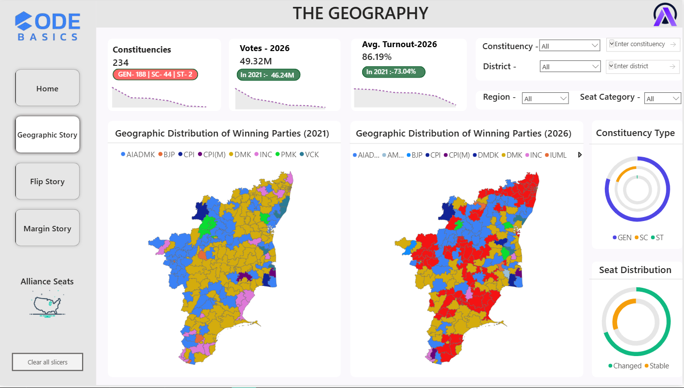
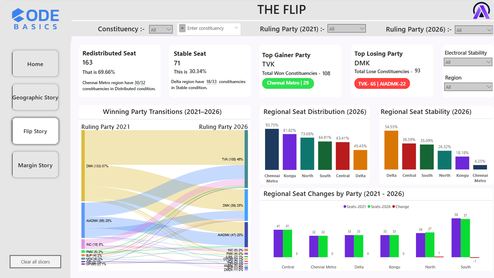
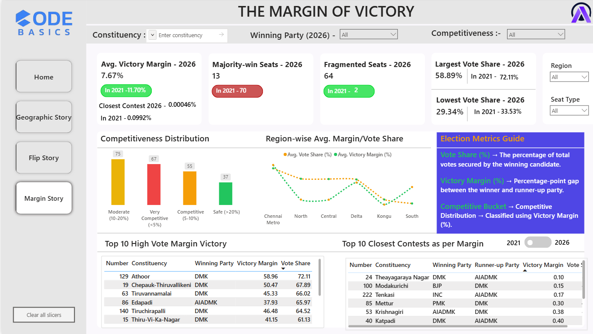
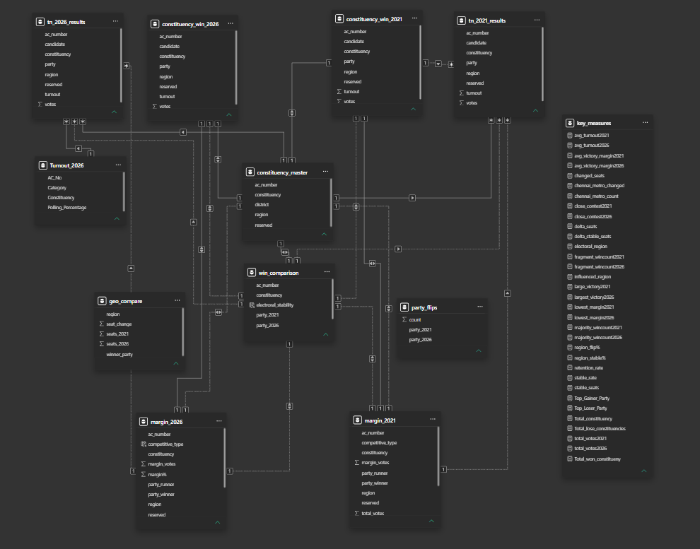

# Tamil Nadu Election 2026 Analysis

## Overview

This project was developed as part of the Tamil Nadu Election Storytelling Challenge organized by Codebasics and AtliQ Technologies.

The objective was to analyze election data and transform it into meaningful stories using data analytics, visualization, and storytelling techniques.

The project focuses on three major analytical questions:

1. Geographic Story
2. Flip Story
3. Margin Story

---

## Project Objective

To identify:

- Regional political shifts
- Constituencies that changed hands
- Seat retention patterns
- Electoral competitiveness
- Strongholds and battleground constituencies

and present these findings through an presentation.

---

## Tech Stack

### Data Processing
- Python
- Pandas
- NumPy

### Visualization
- Power BI

### Mapping
- TopoJSON

---

---

## Dataset Information

The project uses constituency-level election data including:

- Constituency details
- Party information
- Candidate information
- Vote share
- Winning margins
- Regional classifications

---

# Analysis Performed

## Story 1: Geographic Story

### Key Insights

- Region-wise seat redistribution
- Political strongholds
- Seat gain/loss by region
- Geographic voting patterns

---

## Story 2: Flip Story

### Key Insights

- Total Seats Flipped
- Retention Rate
- Region-wise Flip Percentage
- Party-to-Party Transitions

---

## Story 3: Margin Story

### Key Insights

- Average Winning Margin
- Closest Contests
- Largest Victories
- Competitiveness Distribution

---

## TopoJSON Information

This project uses a custom TopoJSON file for constituency-level mapping in Power BI.

Purpose:
- Visualize constituency boundaries
- Display regional political shifts
- Enable geographic storytelling

---

Important Notes:

- Constituency names in Power BI must exactly match constituency names in the TopoJSON file.
- Any spelling mismatch may result in missing map regions.
- The TopoJSON file is used exclusively for visualization and geographic representation.

---

# Dashboard Preview

## Page 1 — Geographic Story

---

## Page 2 — Flip Story

---

## Page 3 — Margin Story

---

## Model View

---

# Acknowledgements

Special thanks to:

- Codebasics
- AtliQ Technologies
- Dhaval Patel
- Hemanand Vadivel
- Bhawin Patel

for organizing this challenge and providing an excellent learning opportunity.

---

# Author

Anubhav
